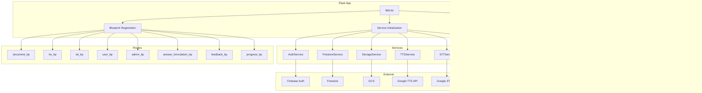

# Active Dependency Graph

> **Purpose**: Document runtime dependencies between all active components  
> **Status**: Verified 2026-01-09

---

## Backend Dependency Graph

---

## Frontend Dependency Graph

---

## Database Dependencies

---

## External API Dependencies

| Service | API | Auth Method |
|---------|-----|-------------|
| LLM | Gemini API | `GOOGLE_API_KEY` |
| STT | Google Cloud Speech | Service Account |
| TTS | Google Cloud TTS | Service Account |
| Storage | Google Cloud Storage | Service Account |
| Database | Firestore | Service Account |
| Auth | Firebase Auth | Firebase SDK |
