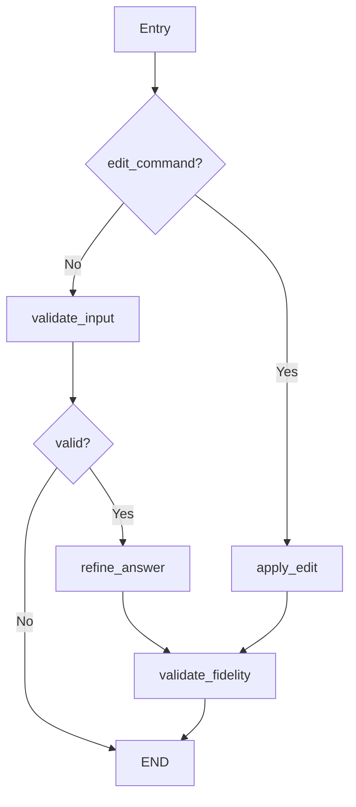

# Analysis: Backend Graphs (LangGraph Implementations)

> **Directory**: [backend/graphs/](file:///C:/Ai/aitutor_37/backend/graphs/)  
> **Status**: [Active] - Core LangGraph agent implementations  
> **Verified**: 2026-01-09

---

## Critical Verification: LLM API Usage

> [!IMPORTANT]
> **ALL graphs use Gemini API with `gemini-3-flash-preview`**  
> Vertex AI is NO LONGER USED (migrated 2026-01-07).

| Graph | File | API Used | Model Source |
|-------|------|----------|--------------|
| **Document Understanding Agent** | `document_understanding_agent/graph.py` | `google.generativeai` (line 15) | `os.getenv("LLM_MODEL_NAME", "gemini-3-flash-preview")` (line 44) |
| **New Chat Graph** | `new_chat_graph.py` | `langchain_google_genai` (line 8) | `os.getenv("LLM_MODEL_NAME", "gemini-3-flash-preview")` (line 78) |
| **Quiz Engine Graph** | `quiz_engine_graph.py` | `langchain_google_genai` (line 7) | `os.getenv("LLM_MODEL_NAME", "gemini-3-flash-preview")` (line 14) |
| **Answer Formulation** | `answer_formulation/graph.py` | `langchain_google_genai` (line 14) | Hardcoded `"gemini-3-flash-preview"` (lines 130, 210, 302) |
| **Supervisor** | `supervisor/graph.py` | Composition only | Invokes chat and quiz graphs |

---

## Graph Architecture

### 1. Document Understanding Agent (DUA) [Active]

**File**: [graph.py](file:///C:/Ai/aitutor_37/backend/graphs/document_understanding_agent/graph.py) (412 lines)

**Purpose**: Analyzes documents (PDF, images) and generates TTS-ready narratives.

**Key Functions**:
- `download_gcs_file_to_bytes()` (line 97): Downloads files from GCS before sending to Gemini API
- `generate_tts_narrative_node()` (line 125): Core LLM invocation
- `run_dua_processing_for_document()` (line 241): Async entry point

**GCS File Handling** (lines 168-174):
```python
if input_file_path.startswith("gs://"):
    file_bytes_content = download_gcs_file_to_bytes(input_file_path)
```

> [!NOTE]
> Gemini API cannot access GCS URIs directly - files must be downloaded first.

### 2. New Chat Graph [Active]

**File**: [new_chat_graph.py](file:///C:/Ai/aitutor_37/backend/graphs/new_chat_graph.py) (232 lines)

**Purpose**: Document-grounded Q&A with conversation history.

**State**: `GeneralQueryState` (line 18)
- `document_id`, `user_id`, `thread_id`
- `messages`: Full conversation history
- `query`, `response`, `error_message`

**Key Function**: `call_chat_llm_node()` (line 71)
- Uses `ChatGoogleGenerativeAI` from langchain
- Loads document via `DocumentRetrievalService`
- Distills conversation history for context

### 3. Quiz Engine Graph [Active]

**File**: [quiz_engine_graph.py](file:///C:/Ai/aitutor_37/backend/graphs/quiz_engine_graph.py) (355 lines)

**Purpose**: Generates and evaluates quiz questions from document content.

**Pydantic Models**:
- `LLMQuestionDetail` (line 19): Question structure
- `LLMQuizResponse` (line 31): LLM response schema

**State**: `QuizEngineState` (line 49)
- `quiz_history`, `current_question_index`, `score`
- `status`: `"initializing"`, `"generating_first_question"`, `"awaiting_answer"`, `"evaluating_answer"`, `"quiz_completed"`, `"error"`

**Key Function**: `call_quiz_engine_node()` (line 180)

### 4. Answer Formulation Graph [Active]

**File**: [answer_formulation/graph.py](file:///C:/Ai/aitutor_37/backend/graphs/answer_formulation/graph.py) (425 lines)

**Purpose**: Transforms spoken transcripts into clear written answers.

**Nodes**:
1. `validate_input_node` (line 31): Validates 5-2000 words
2. `refine_answer_node` (line 99): Core LLM refinement
3. `apply_edit_node` (line 159): Applies voice edit commands
4. `validate_fidelity_node` (line 255): 10% sampling quality check

**Fidelity Sampling** (line 275):
```python
if random.random() >= 0.1:  # Sample only 10%
    return state  # Skip validation
```

**Graph Flow**:


### 5. Supervisor Graph [Active]

**File**: [supervisor/graph.py](file:///C:/Ai/aitutor_37/backend/graphs/supervisor/graph.py) (140 lines)

**Purpose**: Routes user requests to appropriate sub-graphs.

**Sub-graphs Composed**:
- `new_chat_graph` (line 31)
- `quiz_engine_graph` (line 41)

**Routing Decision** (line 83):
- `"new_chat_graph"` → Chat/Q&A
- `"quiz_engine_graph"` → Quiz mode
- `"end"` → Terminate

---

## Checkpoint Persistence

All graphs use `SqliteSaver` with `JsonPlusSerializer`:

| Graph | Database File |
|-------|--------------|
| Quiz Engine | `quiz_checkpoints.db` |
| New Chat | `general_query_checkpoints.db` |
| Supervisor | `supervisor_checkpoints.db` |
| DUA | `document_understanding_checkpoints.db` |
| Answer Formulation | `answer_formulation_sessions.db` |

**Path Resolution** (from `app.py` DatabaseManager):
1. `DATA_DIR` env var
2. `/app/data` (Docker volume)
3. `backend/data` (local fallback)

---

## Known Issues

> [!WARNING]
> **Answer Formulation Hardcoded Model**  
> Lines 130, 210, 302 hardcode `"gemini-3-flash-preview"` instead of using `os.getenv("LLM_MODEL_NAME")`.

> [!NOTE]
> **DUA Test Runner References Local File**  
> Line 399 hardcodes `C:\Ai\aitutor_37\sample_files\Health Insurance2.jpg` - only affects local testing.
