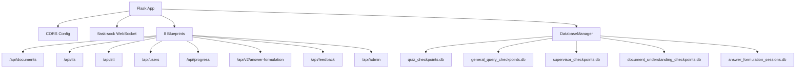

# Analysis: Backend Main (app.py)

> **File**: [app.py](file:///C:/Ai/aitutor_37/backend/app.py) (856 lines, 49KB)  
> **Status**: [Active] - Core Flask application entry point  
> **Verified**: 2026-01-09

---

## Executive Summary

Flask application using **LangGraph-based supervisor architecture** for agent orchestration. Routes are organized via blueprints (lines 169-176). Uses **singleton `DatabaseManager`** (lines 196-288) for thread-safe SQLite checkpointer initialization. WebSocket STT uses `flask-sock` (NOT flask-socketio).

---

## Critical Findings

> [!CAUTION]
> **Healthcheck Path Mismatch**  
> - `backend/Dockerfile` line 89: Uses `/health`  
> - `docker-compose.yml` line 59: Uses `/api/health`  
> - `app.py` line 735: Route defined as `/api/health`  
> 
> The standalone Dockerfile healthcheck will FAIL. Mitigated by docker-compose override.

> [!WARNING]
> **Unused Dependencies in Root requirements.txt**  
> Lines 47, 171, 174, 15 contain `Flask-SocketIO`, `python-socketio`, `python-engineio`, `bidict`.  
> These are NOT used - app uses `flask-sock` instead.

> [!NOTE]
> **Dependency Split**  
> Two requirements.txt files exist. Docker uses `backend/requirements.txt` which correctly includes `pydub==0.25.1` and `flask-sock==0.7.0`.

---

## Architecture



---

## Key Components

### 1. Service Initialization (Lines 124-164) [Active]

| Service | Config Key | Status |
|---------|-----------|--------|
| `AuthService` | `AUTH_SERVICE` | [Active] |
| `FirestoreService` | `FIRESTORE_SERVICE` | [Active] |
| `StorageService` | `STORAGE_SERVICE` | [Active] |
| `TTSService` | `TTS_SERVICE` | [Active] |
| `STTService` | `SERVICES['STTService']` | [Active] |
| `DocumentRetrievalService` | `DOC_RETRIEVAL_SERVICE` | [Active] |

### 2. DatabaseManager Singleton (Lines 196-288) [Active]

**Thread-safe singleton** using `threading.Lock()`.

**Database Path Priority** (lines 214-220):
1. `DATA_DIR` env var → 2. `/app/data` (Docker) → 3. `backend/data` (local)

**Checkpointers**: All use `SqliteSaver` with `JsonPlusSerializer`.

### 3. WebSocket STT (Line 322) [Active]

```python
@sock.route('/ws/stt/stream')
def stt_stream(ws):
```

⚠️ **No authentication in WebSocket handshake** - should validate token.

### 4. Main Chat Route (Lines 337-665) [Active]

```python
@app.route('/api/v2/agent/chat', methods=['POST'])
@require_auth
```

- Supports multipart/form-data (audio) and application/json
- STT modes: `review` and `direct_send`
- Uses `safe_supervisor_invoke()` wrapper (line 548)

### 5. Health Check (Line 735) [Active]

```python
@app.route('/api/health', methods=['GET'])
def health_check():
```

Correctly unprotected for health checks.

---

## Security Analysis

| Route | Protection | Status |
|-------|------------|--------|
| `/api/v2/agent/chat` | `@require_auth` | ✅ |
| `/api/v2/agent/history` | `@require_auth` | ✅ |
| `/api/health` | None | ✅ (correct) |
| `/api/tts/synthesize` | `@require_auth` | ✅ |
| `/api/diagnostics/firestore` | None | ⚠️ Should protect |
| `/ws/stt/stream` | None | ⚠️ Needs token validation |

---

## Docker Integration

### docker-compose.yml Volumes (Lines 18-21)
```yaml
volumes:
  - lexiaid-backend-data:/app/data      # SQLite DBs
  - lexiaid-backend-logs:/app/logs       # Logs
  - ./backend/credentials:/app/credentials:ro  # GCP keys
```

### Healthcheck (Lines 57-63)
Uses correct `/api/health` path via Python script.

---

## Code Quality Notes

1. **Duplicate logging import**: Line 40 re-imports `logging` (already at line 12)
2. **Hardcoded CORS origin**: Line 101 uses `http://localhost:5173` - should use env var
3. **print() statements**: Diagnostic print statements in services should use logging
