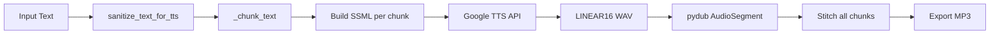

# Analysis: Backend Services

> **Directory**: [backend/services/](file:///C:/Ai/aitutor_37/backend/services/)  
> **Status**: [Active] - Core service layer  
> **Verified**: 2026-01-09

---

## Service Overview

| Service | File | Lines | Status |
|---------|------|-------|--------|
| [TTSService](file:///C:/Ai/aitutor_37/backend/services/tts_service.py) | `tts_service.py` | 516 | [Active] |
| [STTService](file:///C:/Ai/aitutor_37/backend/services/stt_service.py) | `stt_service.py` | 571 | [Active] |
| [AuthService](file:///C:/Ai/aitutor_37/backend/services/auth_service.py) | `auth_service.py` | ~300 | [Active] |
| [FirestoreService](file:///C:/Ai/aitutor_37/backend/services/firestore_service.py) | `firestore_service.py` | ~900 | [Active] |
| [StorageService](file:///C:/Ai/aitutor_37/backend/services/storage_service.py) | `storage_service.py` | ~400 | [Active] |
| [DocumentRetrievalService](file:///C:/Ai/aitutor_37/backend/services/doc_retrieval_service.py) | `doc_retrieval_service.py` | ~450 | [Active] |

---

## TTSService (Text-to-Speech)

**File**: [tts_service.py](file:///C:/Ai/aitutor_37/backend/services/tts_service.py)

### Audio Engine Verification ✅

**pydub Import** (line 35):
```python
from pydub import AudioSegment
```

**WAV Decoding for Precise Timing** (line 402):
```python
chunk_audio = AudioSegment.from_wav(io.BytesIO(response.audio_content))
```

**MP3 Export** (line 466):
```python
combined_audio_segment.export(buffer, format="mp3")
```

### Architecture



### Key Features

1. **Chunking** (lines 103-225): Splits text at 2500 chars, preserving paragraphs
2. **SSML Marks** (lines 262-331): Generates word-level timepoints
3. **Paragraph Break Markers**: Special `PARAGRAPH_BREAK` timepoints for highlighting

### Dependencies
- `google-cloud-texttospeech` (v1beta1 for timepoints)
- `pydub` (audiO stitching)
- `ffmpeg` (installed in Dockerfile line 57)

---

## STTService (Speech-to-Text)

**File**: [stt_service.py](file:///C:/Ai/aitutor_37/backend/services/stt_service.py)

### JSON Import Verification ✅

**Line 18**:
```python
import json
```

Required for WebSocket response serialization (line 553):
```python
ws.send(json.dumps(response_data))
```

### Key Methods

| Method | Purpose | Lines |
|--------|---------|-------|
| `transcribe_audio_bytes()` | Sync recognition | 75-235 |
| `transcribe_audio_file()` | File-based recognition | 237-286 |
| `transcribe_audio_batch()` | Long-running GCS recognition | 288-344 |
| `streaming_recognize()` | Real-time stream | 346-382 |
| `handle_stt_stream()` | WebSocket handler | 468-570 |

### WebSocket Handler (lines 468-570)

Uses `WEBM_OPUS` encoding for browser compatibility:
```python
config = speech.RecognitionConfig(
    encoding=speech.RecognitionConfig.AudioEncoding.WEBM_OPUS,
    sample_rate_hertz=16000,
    language_code="en-US",
    enable_automatic_punctuation=True,
)
```

---

## FirestoreService

**File**: [firestore_service.py](file:///C:/Ai/aitutor_37/backend/services/firestore_service.py)

### Data Healing Verification ✅

**Method**: `ensure_user_profile()` (called from `user_routes.py` line 161)

Creates user profile if missing, used for:
- Google Sign-In users
- Legacy users without profiles

### Key Collections

| Collection | Purpose |
|-----------|---------|
| `users` | User profiles with preferences |
| `documents` | Document metadata |
| `feedback` | User feedback/bug reports |

---

## StorageService

**File**: [storage_service.py](file:///C:/Ai/aitutor_37/backend/services/storage_service.py)

### Key Methods

| Method | Purpose |
|--------|---------|
| `upload_file()` | Upload file to GCS |
| `upload_bytes_as_file()` | Upload bytes directly |
| `upload_string_as_file()` | Upload JSON/text |
| `download_file_to_bytes()` | Download from GCS |
| `get_signed_url()` | Generate temporary access URL |
| `delete_file_from_gcs()` | Delete from GCS |

---

## Code Quality Notes

> [!WARNING]
> **Diagnostic print() Statements**  
> `tts_service.py` lines 9-24 contain diagnostic prints that should use `logging`:
> ```python
> print("--- DIAGNOSTIC: START ---")
> print("Python Executable:", sys.executable)
> ```

> [!NOTE]
> **Debug Audio Files**  
> `stt_service.py` saves debug audio to `backend/debug_audio/` (lines 156-168).  
> This directory is correctly gitignored but accumulates files in development.
