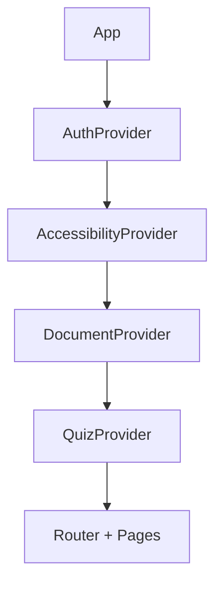

# Analysis: Frontend Contexts

> **Directory**: [src/contexts/](file:///C:/Ai/aitutor_37/src/contexts/)  
> **Count**: 4 React contexts  
> **Status**: [Active]  
> **Verified**: 2026-01-09

---

## Context Inventory

| File | Purpose | Status |
|------|---------|--------|
| [AuthContext.tsx](file:///C:/Ai/aitutor_37/src/contexts/AuthContext.tsx) | Firebase authentication state | [Active] |
| [AccessibilityContext.tsx](file:///C:/Ai/aitutor_37/src/contexts/AccessibilityContext.tsx) | User preferences + UI TTS | [Active] |
| [DocumentContext.tsx](file:///C:/Ai/aitutor_37/src/contexts/DocumentContext.tsx) | Active document state | [Active] |
| [QuizContext.tsx](file:///C:/Ai/aitutor_37/src/contexts/QuizContext.tsx) | Quiz session state | [Active] |

---

## AuthContext.tsx

### Purpose
Manages Firebase authentication state and provides auth methods.

### Provided Values

```tsx
interface AuthContextType {
  currentUser: User | null;
  loading: boolean;
  signIn: (email: string, password: string) => Promise<void>;
  signUp: (email: string, password: string) => Promise<void>;
  signOut: () => Promise<void>;
  signInWithGoogle: () => Promise<void>;
  resetPassword: (email: string) => Promise<void>;
  getAuthToken: () => Promise<string | null>;
  isAdmin: boolean;
}
```

### Key Features
- Listens to `onAuthStateChanged` for auth state
- `getAuthToken()` returns Firebase ID token for API calls
- `isAdmin` checks custom claims

---

## AccessibilityContext.tsx

### Purpose
Manages user accessibility preferences and UI TTS.

### Provided Values

```tsx
interface AccessibilityContextType {
  // Visual Settings
  fontSize: number;
  fontFamily: string;
  lineSpacing: number;
  wordSpacing: number;
  textColor: string;
  backgroundColor: string;
  highContrast: boolean;
  
  // TTS Settings
  uiTtsEnabled: boolean;
  ttsVoice: string;
  ttsSpeed: number;
  ttsPitch: number;
  cloudTtsEnabled: boolean;
  
  // Methods
  updatePreferences: (prefs: Partial<UserPreferences>) => void;
  speakText: (text: string) => void;
  toggleUiTts: () => void;
}
```

### Preference Sync
- Loads from Firestore user profile on mount
- Saves to Firestore on preference change
- Falls back to localStorage for anonymous users

---

## DocumentContext.tsx

### Purpose
Tracks the currently active document across the application.

### Provided Values

```tsx
interface DocumentContextType {
  activeDocumentId: string | null;
  setActiveDocumentId: (id: string | null) => void;
}
```

### Usage
- Set when entering DocumentView
- Used by ChatPage to load document context
- Cleared on logout

---

## QuizContext.tsx

### Purpose
Manages quiz session state for the quiz feature.

### Provided Values

```tsx
interface QuizContextType {
  quizState: QuizState;
  startQuiz: (documentId: string) => void;
  submitAnswer: (answer: string) => void;
  nextQuestion: () => void;
  resetQuiz: () => void;
}
```

### State
- `currentQuestion`: Active question data
- `score`: Current score
- `totalQuestions`: Quiz length
- `isComplete`: Quiz finished flag

---

## Context Hierarchy



All contexts must be nested in this order for proper dependency resolution.
