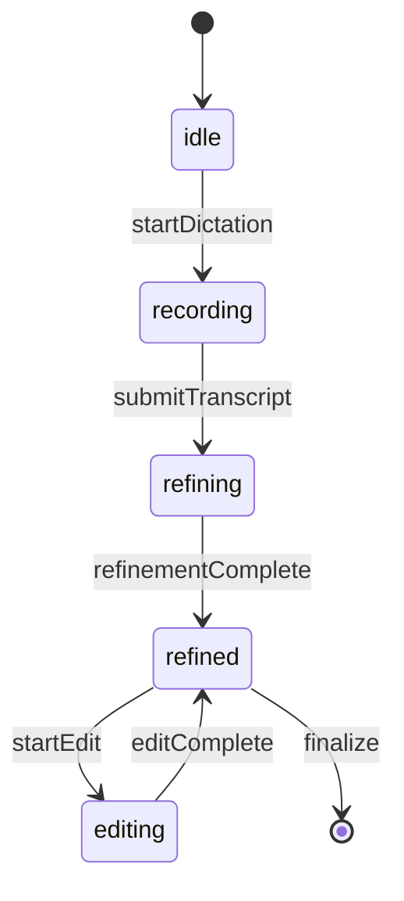

# Analysis: Frontend Hooks

> **Directory**: [src/hooks/](file:///C:/Ai/aitutor_37/src/hooks/)  
> **Count**: 4 custom hooks  
> **Status**: [Active]  
> **Verified**: 2026-01-09

---

## Hook Inventory

| File | Lines | Purpose | Status |
|------|-------|---------|--------|
| [useTTSPlayer.ts](file:///C:/Ai/aitutor_37/src/hooks/useTTSPlayer.ts) | 216 | Audio playback + word highlighting | [Active] |
| [useAudioRecorder.ts](file:///C:/Ai/aitutor_37/src/hooks/useAudioRecorder.ts) | ~150 | Audio recording to blob | [Active] |
| [useRealtimeStt.ts](file:///C:/Ai/aitutor_37/src/hooks/useRealtimeStt.ts) | ~180 | WebSocket STT streaming | [Active] |
| [useAnswerFormulation.ts](file:///C:/Ai/aitutor_37/src/hooks/useAnswerFormulation.ts) | ~220 | Answer formulation session | [Active] |

---

## useTTSPlayer.ts (216 lines)

### Verified Patterns ✅

**isPlayingRef** (line 22):
```tsx
const isPlayingRef = useRef<boolean>(false);
```

Uses `useRef` instead of `useState` to avoid stale closure issues in audio event handlers.

### State Machine

```
idle → loading → playing ⇄ paused → idle
```

### Key Functions

| Function | Purpose |
|----------|---------|
| `playAudio(options?)` | Start/pause/resume playback |
| `stopAudio()` | Stop and cleanup |
| `seekAndPlay(time)` | Jump to timestamp |
| `startPlayback(options)` | Internal: load and play |

### Asset Loading Priority

1. Pre-generated assets: `apiService.getTtsAssets(documentId)`
2. Fallback: On-demand synthesis `apiService.synthesizeText(text)`

### Return Value

```tsx
return { playAudio, stopAudio, seekAndPlay, status, error, activeTimepoint, wordTimepoints };
```

---

## useAudioRecorder.ts

### Purpose
Records audio from microphone, outputs as Blob for upload.

### Key States
- `isRecording`: Currently recording
- `audioBlob`: Recorded audio

### Media Constraints
```tsx
audio: { 
  echoCancellation: true, 
  noiseSuppression: true 
}
```

---

## useRealtimeStt.ts

### Purpose
Manages WebSocket connection for real-time speech-to-text.

### WebSocket Endpoint
```tsx
const wsUrl = `${backendUrl.replace('http', 'ws')}/ws/stt/stream`;
```

### Message Types
- **Incoming**: `{ is_final: boolean, transcript: string, stability: number }`
- **Outgoing**: Binary audio chunks

### States
- `isConnected`: WebSocket connection status
- `transcript`: Current transcription
- `isFinal`: Whether transcript is finalized

---

## useAnswerFormulation.ts

### Purpose
Manages Answer Formulation session state and API calls.

### Session Flow



### API Integration
- `POST /api/v2/answer-formulation/refine`
- `POST /api/v2/answer-formulation/edit`

### Return Value
```tsx
return {
  sessionId, status, question, transcript, refinedAnswer,
  fidelityScore, startSession, submitTranscript, applyEdit, reset
};
```

---

## Code Quality Notes

> [!NOTE]
> **Cleanup Patterns**  
> All hooks properly clean up resources in `useEffect` return:
> - `useTTSPlayer`: Revokes blob URLs, stops audio
> - `useRealtimeStt`: Closes WebSocket
> - `useAudioRecorder`: Stops media tracks
