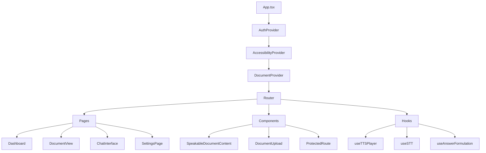

# Analysis: Frontend Main

> **Directory**: [src/](file:///C:/Ai/aitutor_37/src/)  
> **Framework**: React 18 + TypeScript + Vite  
> **Status**: [Active]  
> **Verified**: 2026-01-09

---

## Critical Verification Matrix ✅

### Event Handler Pattern

**File**: [DocumentView.tsx](file:///C:/Ai/aitutor_37/src/pages/DocumentView.tsx) (300 lines)

**Line 233** - Arrow function wrapper:
```tsx
onClick={() => playAudio()}
```

This prevents immediate invocation during render, ensuring the handler only fires on user click.

### TTS Player State Tracking

**File**: [useTTSPlayer.ts](file:///C:/Ai/aitutor_37/src/hooks/useTTSPlayer.ts) (216 lines)

**Line 22** - Ref-based tracking:
```tsx
const isPlayingRef = useRef<boolean>(false);
```

Used at:
- Line 30: Reset on stop
- Line 128: Set false on end
- Line 146: Set true on play
- Lines 175-178: Pause logic

> [!NOTE]
> Uses `useRef` instead of `useState` for `isPlayingRef` to avoid stale closure issues in event handlers.

### API Base URL

**Line 84** of `DocumentView.tsx`:
```tsx
const apiUrl = import.meta.env.VITE_BACKEND_API_URL || 'http://localhost:8081';
```

Default fallback is port 8081, not 8000.

---

## Architecture Overview



---

## Key Files

### Pages

| File | Lines | Purpose |
|------|-------|---------|
| [DocumentView.tsx](file:///C:/Ai/aitutor_37/src/pages/DocumentView.tsx) | 300 | Document display with TTS |
| [Dashboard.tsx](file:///C:/Ai/aitutor_37/src/pages/Dashboard.tsx) | ~250 | Document list, upload |
| [ChatInterface.tsx](file:///C:/Ai/aitutor_37/src/pages/ChatInterface.tsx) | ~400 | Chat/Quiz UI |
| [Settings.tsx](file:///C:/Ai/aitutor_37/src/pages/Settings.tsx) | ~350 | User preferences |

### Hooks

| File | Lines | Purpose |
|------|-------|---------|
| [useTTSPlayer.ts](file:///C:/Ai/aitutor_37/src/hooks/useTTSPlayer.ts) | 216 | Audio playback + highlighting |
| [useSTT.ts](file:///C:/Ai/aitutor_37/src/hooks/useSTT.ts) | ~150 | WebSocket STT |
| [useAnswerFormulation.ts](file:///C:/Ai/aitutor_37/src/hooks/useAnswerFormulation.ts) | ~200 | AF session state |

### Contexts

| File | Purpose |
|------|---------|
| [AuthContext.tsx](file:///C:/Ai/aitutor_37/src/contexts/AuthContext.tsx) | Firebase auth state |
| [AccessibilityContext.tsx](file:///C:/Ai/aitutor_37/src/contexts/AccessibilityContext.tsx) | Preferences + UI TTS |
| [DocumentContext.tsx](file:///C:/Ai/aitutor_37/src/contexts/DocumentContext.tsx) | Active document state |

---

## Component Details

### DocumentView.tsx

**Tabs**: `read`, `chat`, `quiz`

**TTS Integration**:
```tsx
const { playAudio, stopAudio, seekAndPlay, status, activeTimepoint, wordTimepoints } = useTTSPlayer(
  id || null,
  document?.content || ''
);
```

**Word Highlighting**: Renders `SpeakableDocumentContent` when TTS active (lines 148-154).

### useTTSPlayer.ts

**States**:
- `idle` → Initial
- `loading` → Fetching assets/synthesizing
- `playing` → Audio playing
- `paused` → User paused

**Asset Loading Priority**:
1. Try pre-generated assets via `apiService.getTtsAssets(documentId)`
2. Fall back to on-demand synthesis via `apiService.synthesizeText(text)`

**Timepoint Tracking** (lines 110-124):
```tsx
audio.ontimeupdate = () => {
  for (let i = 0; i < timepoints.length; i++) {
    if (audio.currentTime >= tp.time_seconds) {
      currentWordTimepoint = tp;
    }
  }
  setActiveTimepoint(currentWordTimepoint);
};
```

---

## Known Issues

> [!WARNING]
> **Default API Port Mismatch**  
> `DocumentView.tsx` defaults to port `8081`, but backend Dockerfile exposes `5000`.  
> In production, `VITE_BACKEND_API_URL` must be set correctly.

> [!NOTE]
> **No HTML Entity Decoding in DocumentView**  
> The `document.content` is rendered directly. HTML entities must be decoded backend-side (in TTS service via `sanitize_text_for_tts`) or in `SpeakableDocumentContent`.
