# Speech-to-Text (STT) Review State Enhancement Report

## Executive Summary

This report documents the comprehensive enhancement of the Speech-to-Text (STT) feature in the AI Tutor application, specifically focusing on adding Text-to-Speech (TTS) playback functionality during the STT review state. The implementation allows users to hear audio playback of transcribed text before sending messages, improving accessibility and user experience.

---

## Problem Statement

### Initial Issues Identified

1. **Missing TTS Playback in Review State**: After users completed voice dictation, they entered a "review state" where they could see and edit the transcribed text. However, there was no way to hear the text read back before sending the message.

2. **CSS Visibility Bug**: The Play button code existed but was invisible due to undefined CSS variables (`var(--text-color-secondary)` and `var(--background-color-hover)`).

3. **Limited Scope**: The Play button only appeared after dictation completion (`status === 'review'`), not when users manually typed text.

4. **State Management Issue**: The status didn't properly reset from `'review'` to `'idle'` after sending a message, causing state machine inconsistencies.

---

## Solution Architecture

### Design Decisions

1. **Reuse Existing Infrastructure**: Leveraged the existing `useOnDemandTTSPlayer` hook and backend TTS service.
2. **Enhanced Visibility Logic**: Extended Play button visibility to both review state and idle state with text.
3. **Improved State Machine**: Fixed state transitions to properly cycle through: `idle` → `connecting` → `dictating` → `review` → `idle`.
4. **Better UX Layout**: Moved Play button to the left side for clear visual separation.

---

## Files Modified

### 1. `src/hooks/useRealtimeStt.ts`

**Purpose**: Manages STT state machine and transcript handling.

**Key Modification**: Enhanced `updateTranscript` function

**Before:**
```typescript
const updateTranscript = useCallback((newText: string) => {
  if (status === 'review') {
    setTranscript({ final: newText, interim: '' });
  }
}, [status]);
```

**After:**
```typescript
const updateTranscript = useCallback((newText: string) => {
  if (status === 'review' || status === 'idle') {
    setTranscript({ final: newText, interim: '' });
    // If clearing the transcript (empty string), reset to idle
    if (newText === '' && status === 'review') {
      setStatus('idle');
    }
  }
}, [status]);
```

**Changes Made:**
- ✅ Allowed transcript updates in both `'review'` and `'idle'` states
- ✅ Added automatic status reset to `'idle'` when clearing transcript (empty string)
- ✅ Fixed state machine transition from review back to idle

**Impact**: Ensures proper state lifecycle and prevents the component from getting stuck in review state.

---

### 2. `src/components/GeminiChatInterface.tsx`

**Purpose**: Main chat interface component containing the input bar and message display.

#### **Modification A: Enhanced Play Button Visibility Logic**

**Location**: `ChatInputBar` component

**Before:**
```typescript
{status === 'review' && (
  // Play button only shown after dictation
)}
```

**After:**
```typescript
{(status === 'review' || (status === 'idle' && combinedTranscript.trim())) && (
  // Play button shown in review state OR when typing text in idle state
)}
```

**Changes Made:**
- ✅ Play button now appears when `status === 'review'` (after dictation)
- ✅ Play button also appears when `status === 'idle' && combinedTranscript.trim()` (when typing text)
- ✅ Added `disabled` attribute when transcript is empty
- ✅ Added `aria-label` attributes for accessibility
- ✅ Added defensive check to trim transcript before playing

#### **Modification B: Auto-Stop TTS on Send**

**Location**: `handleSend` function

**Before:**
```typescript
const handleSend = () => {
  if (combinedTranscript.trim()) {
    onSendMessage(combinedTranscript.trim());
    updateTranscript(''); // Clear transcript after sending
  }
};
```

**After:**
```typescript
const handleSend = () => {
  if (combinedTranscript.trim()) {
    // Stop any ongoing TTS playback before sending
    if (onDemandStatus === 'playing' || onDemandStatus === 'loading') {
      stopAudio();
    }
    onSendMessage(combinedTranscript.trim());
    updateTranscript(''); // Clear transcript after sending
  }
};
```

**Changes Made:**
- ✅ Automatically stops TTS playback when user sends message
- ✅ Prevents audio overlap and improves UX

#### **Modification C: Layout Restructuring**

**Before Structure:**
```
[Textarea] [Play] [Re-record] [Mic] [Send]
```

**After Structure:**
```
[Play] [Textarea] [Re-record] [Mic] [Send]
```

**Changes Made:**
- ✅ Created new `.leftControls` container for Play/Stop button
- ✅ Moved Play button to the left side of the textarea
- ✅ Kept Microphone and Send buttons on the right side
- ✅ Added clear comments for each section

---

### 3. `src/components/GeminiChatInterface.module.css`

**Purpose**: Styles for the chat interface components.

#### **Modification A: Fixed `.reviewButton` Styles**

**Before:**
```css
.reviewButton {
  padding: 0.5rem;
  border-radius: 9999px;
  color: var(--text-color-secondary); /* UNDEFINED VARIABLE */
  background-color: transparent;
  transition: background-color 0.2s;
}

.reviewButton:hover {
  background-color: var(--background-color-hover); /* UNDEFINED VARIABLE */
}
```

**After:**
```css
.reviewButton {
  padding: 0.5rem; /* 8px */
  border-radius: 9999px; /* full */
  color: #a0a0a0; /* Light gray for dark theme */
  background-color: transparent;
  border: none;
  cursor: pointer;
  display: flex;
  align-items: center;
  justify-content: center;
  transition: all 0.2s ease;
  height: 36px;
  width: 36px;
}

.reviewButton:hover {
  background-color: rgba(255, 255, 255, 0.1);
  color: #e0e0e0;
}

.reviewButton:disabled {
  opacity: 0.3;
  cursor: not-allowed;
}

.reviewButton:disabled:hover {
  background-color: transparent;
  color: #a0a0a0;
}
```

**Changes Made:**
- ✅ Replaced undefined CSS variables with explicit color values
- ✅ Added explicit sizing (36x36px) for consistent button dimensions
- ✅ Added flexbox properties for proper icon centering
- ✅ Added disabled state styling (30% opacity)
- ✅ Added hover state with semi-transparent background
- ✅ Set colors compatible with dark theme

#### **Modification B: Added `.leftControls` Container**

**New Code:**
```css
.leftControls {
  display: flex;
  align-items: center;
  gap: 0.5rem; /* 8px */
}
```

**Changes Made:**
- ✅ Created new container class for left-side controls
- ✅ Matches styling of existing `.sttControls` for consistency
- ✅ Uses flexbox for proper alignment

---

## State Machine Flow

### STT Status States

```mermaid
stateDiagram-v2
    [*] --> idle
    idle --> connecting: startDictation()
    connecting --> dictating: WebSocket connected
    dictating --> review: stopDictation()
    review --> idle: handleSend() → updateTranscript('')
    review --> dictating: rerecord()
```



### Button Visibility Matrix

| State | Text in Input | Buttons Visible |
|-------|---------------|-----------------|
| `idle` | No | 🎤 Microphone, 📤 Send (disabled) |
| `idle` | Yes | ▶️ **Play**, 🎤 Microphone, 📤 Send |
| `connecting` | Any | ⏳ Connecting, 📤 Send |
| `dictating` | Any | 🛑 Stop, 📤 Send (disabled) |
| `review` | Yes | ▶️ **Play**, 🔄 **Re-record**, 📤 Send |

---

## Key Functions Modified

### 1. `updateTranscript(newText: string)` - `useRealtimeStt.ts`

**Purpose**: Updates the transcript text and manages state transitions.

**Parameters:**
- `newText`: The new transcript text (string)

**Behavior:**
- Allows updates in both `'review'` and `'idle'` states
- Automatically resets status to `'idle'` when clearing transcript from review state
- Maintains state machine integrity

### 2. `handleSend()` - `GeminiChatInterface.tsx`

**Purpose**: Handles message sending with TTS cleanup.

**Behavior:**
- Checks if TTS is playing or loading
- Stops audio playback before sending
- Sends the message
- Clears the transcript (triggers state reset to idle)

### 3. Play Button Conditional Rendering

**Purpose**: Controls when the Play button is visible.

**Logic:**
```typescript
{(status === 'review' || (status === 'idle' && combinedTranscript.trim())) && (
  // Render Play/Stop button
)}
```

**Conditions:**
- Shows in `'review'` state (after dictation)
- Shows in `'idle'` state when text exists
- Hides when input is empty

---

## Integration with Existing Systems

### Hooks Used

1. **`useRealtimeStt()`** - Manages STT state and WebSocket connection
   - Returns: `status`, `transcript`, `startDictation`, `stopDictation`, `rerecord`, `updateTranscript`

2. **`useOnDemandTTSPlayer()`** - Manages TTS playback for user-generated text
   - Returns: `playText`, `stopAudio`, `status`, `activeTimepoint`, `wordTimepoints`

3. **`useChatTTSPlayer()`** - Manages TTS playback for agent messages
   - Returns: `playAudio`, `stopAudio`, `seekAndPlay`, `status`, `activeTimepoint`

### Backend Services

- **TTS Service**: `/api/tts/synthesize` endpoint (already implemented)
- **STT Service**: `/api/stt/stream` WebSocket endpoint (already implemented)

---

## Testing Scenarios

### Scenario 1: Manual Text Entry with TTS
1. User types "Hello world" in input box
2. Play button (▶️) appears on the left
3. User clicks Play → TTS reads "Hello world"
4. Icon changes to Stop (🔇)
5. User clicks Stop → Audio stops, icon returns to Play

### Scenario 2: Dictation with Review
1. User clicks Microphone (🎤)
2. Status changes to `'connecting'` → `'dictating'`
3. User speaks: "This is a test"
4. User clicks Stop → Status changes to `'review'`
5. Play (▶️) and Re-record (🔄) buttons appear
6. User clicks Play → Hears dictated text
7. User clicks Send → Status resets to `'idle'`

### Scenario 3: Send During Playback
1. User types text and clicks Play
2. While audio is playing, user clicks Send
3. Audio stops immediately
4. Message is sent
5. Input clears and status resets to `'idle'`

---

## Accessibility Improvements

1. **ARIA Labels**: Added `aria-label` attributes to all buttons
   - "Play audio of transcribed text"
   - "Stop audio playback"
   - "Re-record dictation"

2. **Keyboard Support**: Existing keyboard shortcuts maintained
   - Enter to send
   - Shift+Enter for new line

3. **Visual Feedback**:
   - Disabled state (30% opacity) when no text
   - Loading spinner during TTS synthesis
   - Hover effects for better interactivity

---

## Performance Considerations

1. **State Updates**: Minimized re-renders by using `useCallback` hooks
2. **Conditional Rendering**: Buttons only render when needed
3. **Audio Cleanup**: Proper cleanup of audio resources on unmount
4. **WebSocket Management**: Existing connection handling maintained

---

## Known Limitations & Future Enhancements

### Current Limitations
1. Play button only works with text content (no support for images/attachments)
2. No pause/resume functionality (only play/stop)
3. No playback speed control

### Potential Future Enhancements
1. Add pause/resume capability to TTS playback
2. Add playback speed controls (0.5x, 1x, 1.5x, 2x)
3. Add voice selection options
4. Implement keyboard shortcut for Play (e.g., Ctrl+P)
5. Add visual indicator on textarea during playback
6. Support for playing back formatted text (markdown)

---

## Conclusion

The STT review state enhancement successfully addresses the original problem of missing TTS playback functionality. The implementation:

✅ **Fixed CSS visibility issues** by replacing undefined variables  
✅ **Enhanced state management** with proper idle/review transitions  
✅ **Expanded functionality** to support both dictated and typed text  
✅ **Improved UX** with better button positioning and auto-stop on send  
✅ **Maintained code quality** with accessibility features and clear documentation  

The solution is production-ready, fully tested, and integrates seamlessly with existing systems while providing a significantly improved user experience for accessibility-focused features.
