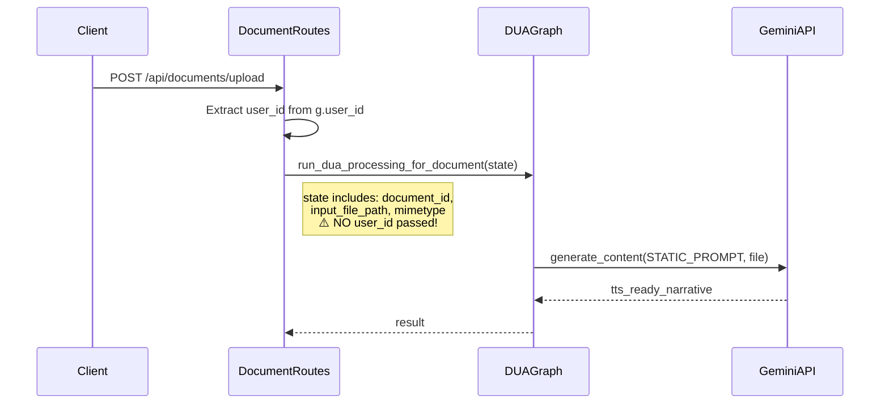
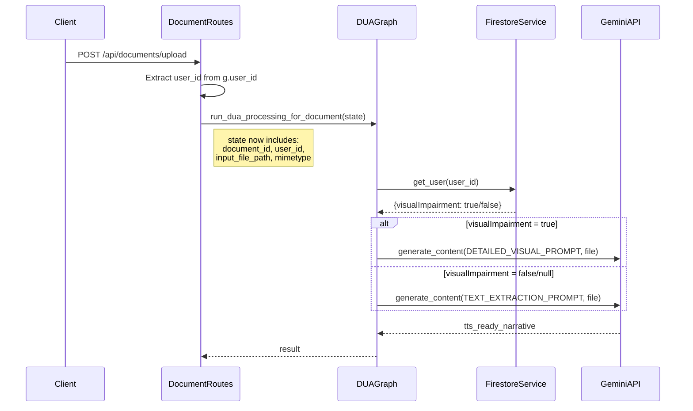

# Adaptive DUA Implementation Plan
> **Feature**: Adaptive Image Processing based on User's Visual Impairment Status  
> **Date**: 2026-01-12  
> **Reference**: LexiAid Roadmap - Section 2 (Feature Development)  
> **Prerequisite**: User Profile Schema ✅ (Completed)

---

## 1. Executive Summary

This plan modifies the Document Understanding Agent (DUA) to adapt its image analysis prompts based on the user's `visualImpairment` status stored in their Firestore profile. When a visually impaired user uploads a document, the DUA will provide **detailed visual descriptions** of all images, scenes, and aesthetics. For non-visually-impaired users, the DUA will **strictly extract text and data**, avoiding unnecessary visual descriptions.

---

## 2. Current State Analysis

### 2.1 Key Findings

| Component | File | Current Behavior |
|-----------|------|-----------------|
| **DUA State** | [state.py](file:///c:/Ai/aitutor_37/backend/graphs/document_understanding_agent/state.py) | TypedDict with 9 fields. No `user_id` field. |
| **DUA Graph** | [graph.py](file:///c:/Ai/aitutor_37/backend/graphs/document_understanding_agent/graph.py#L46-89) | Uses static `COMPREHENSIVE_LLM_PROMPT` (lines 46-89) for all users. |
| **Document Upload** | [document_routes.py](file:///c:/Ai/aitutor_37/backend/routes/document_routes.py#L136-141) | Passes `document_id`, `gcs_uri`, `mimetype` to DUA. `user_id` available via `g.user_id` but NOT passed. |
| **User Profile Fetch** | [firestore_service.py](file:///c:/Ai/aitutor_37/backend/services/firestore_service.py#L102-116) | `get_user(user_id)` returns full user dict including `visualImpairment`. |
| **Visual Impairment Field** | [user_routes.py](file:///c:/Ai/aitutor_37/backend/routes/user_routes.py#L48) | `visualImpairment` (bool) stored in Firestore `users` collection. |

### 2.2 Current DUA Invocation Flow



---

## 3. Proposed Changes

### 3.1 State Schema Update

#### [MODIFY] [state.py](file:///c:/Ai/aitutor_37/backend/graphs/document_understanding_agent/state.py)

Add `user_id` field to `DocumentUnderstandingState`:

```diff
 class DocumentUnderstandingState(TypedDict):
     document_id: str
+    user_id: Optional[str] = None  # Firebase Auth UID for profile lookup
     original_gcs_uri: str # GCS URI of the original uploaded document
     
     # ... existing fields ...
```

---

### 3.2 Document Routes Update

#### [MODIFY] [document_routes.py](file:///c:/Ai/aitutor_37/backend/routes/document_routes.py)

Pass `user_id` to the DUA initial state (around line 136-141):

```diff
 dua_initial_state = {
     "document_id": document_id,
+    "user_id": user_id,  # Pass authenticated user's ID for profile lookup
     "input_file_path": gcs_uri,
     "input_file_mimetype": file.mimetype,
     "original_gcs_uri": gcs_uri
 }
```

---

### 3.3 Prompt Templates

#### [MODIFY] [graph.py](file:///c:/Ai/aitutor_37/backend/graphs/document_understanding_agent/graph.py)

Define two distinct prompt templates as module-level constants:

```python
# --- Prompt Templates Based on Visual Impairment Status ---

# For users WITH visual impairment (visualImpairment=True)
# Provides rich, detailed visual descriptions
PROMPT_VISUAL_IMPAIRMENT_TRUE = """You are an advanced document analysis assistant. Your task is to analyze the provided document file, which may contain a mix of text, images, tables, and graphs/charts. Your goal is to produce a single, coherent, and detailed textual output that accurately represents the document's content as if you were meticulously reading it aloud for someone with visual impairments.

**CRITICAL INSTRUCTION FOR IMAGES**: Provide detailed visual descriptions of ALL images, scenes, and aesthetics. Describe:
- Colors, lighting, composition, and artistic style
- Facial expressions, body language, and emotions of people
- Environmental details, backgrounds, and atmosphere
- Spatial relationships between objects
- Any symbolic or contextual meaning the image may convey

For example, instead of "An image of a classroom," say: "The photograph shows a brightly lit classroom with pale yellow walls. A teacher stands near a whiteboard gesturing enthusiastically. Several students sit at wooden desks, some taking notes, others looking attentively toward the front. Natural sunlight streams through large windows on the left side, creating warm highlights on the students' faces."

Please perform the following:

1.  Overall Structure and Reading Order:
    * CRITICAL: Begin from the absolute top-left of the document. Process images FIRST if they appear at the top.
    * For multi-column layouts: Process leftmost column entirely before moving right.
    * Produce a single, continuous narrative following this sequential reading path.

2.  Textual Content:
    * Extract all text verbatim in reading order.
    * Preserve original wording and sentence structure.
    * Use proper punctuation for natural TTS rendering.

3.  Images:
    * Provide DETAILED visual descriptions as instructed above.
    * State position in flow (e.g., "Following the heading, an image appears...").
    * Transcribe ALL text within images accurately.
    * Explain the context and significance of visual elements.

4.  Tables:
    * Provide title/summary of the table's purpose.
    * Translate table data into spoken-word narrative.
    * Use proper punctuation for TTS clarity.

5.  Graphs and Charts:
    * Identify type (bar, line, pie, etc.).
    * Describe visual characteristics (colors, patterns, proportions).
    * Explain trends, data points, and main message.

Output Requirements:
* Single, continuous, well-structured text.
* Clear, concise language suitable for TTS.
* Meticulous punctuation throughout.
* Neutral, objective, academic tone.
"""

# For users WITHOUT visual impairment (visualImpairment=False or None)
# Focus on text extraction, minimal visual description
PROMPT_VISUAL_IMPAIRMENT_FALSE = """You are an advanced document analysis assistant. Your task is to analyze the provided document file, which may contain text, images, tables, and graphs/charts. Your goal is to produce a single, coherent textual output optimized for Text-to-Speech (TTS) consumption by someone familiar with the document layout.

**CRITICAL INSTRUCTION FOR IMAGES**: Strictly extract text and data. Do NOT describe visual aesthetics, scenes, colors, or artistic elements unless absolutely necessary for understanding the content context.

For images:
- Transcribe any text visible within the image
- Provide only a brief one-sentence identification (e.g., "An image of a bar chart is shown here.")
- Focus on informational content, not visual description

Please perform the following:

1.  Overall Structure and Reading Order:
    * Begin from the absolute top-left, proceeding top-to-bottom, left-to-right.
    * For multi-column layouts: Process leftmost column entirely before moving right.
    * Produce a single, continuous narrative.

2.  Textual Content:
    * Extract all text verbatim in reading order.
    * Preserve original wording and structure.
    * Use proper punctuation for TTS clarity.

3.  Images:
    * Provide ONLY a brief identifier (one sentence max).
    * Transcribe all text within the image.
    * Do NOT describe colors, aesthetics, or visual details.

4.  Tables:
    * Provide title/summary of purpose.
    * Translate data into spoken-word format.
    * Ensure TTS-friendly punctuation.

5.  Graphs and Charts:
    * Identify type briefly.
    * Describe key data points and trends.
    * Focus on data, not visual presentation.

Output Requirements:
* Single, continuous text optimized for TTS.
* Focus on informational content extraction.
* Clear punctuation throughout.
* Neutral, academic tone.
"""
```

---

### 3.4 Graph Node Modification

#### [MODIFY] [graph.py](file:///c:/Ai/aitutor_37/backend/graphs/document_understanding_agent/graph.py)

Modify `generate_tts_narrative_node` to fetch user profile and select appropriate prompt:

```python
# Pseudo-code for the modified generate_tts_narrative_node function

def generate_tts_narrative_node(state: DocumentUnderstandingState) -> DocumentUnderstandingState:
    logger.info(f"Entering generate_tts_narrative_node for doc: {state.get('document_id')}")
    state['error_message'] = None  # Clear previous errors
    
    # ... existing validation (Gemini API init, file path/bytes checks) ...
    
    # --- NEW: Fetch User Profile and Select Prompt ---
    user_id = state.get('user_id')
    selected_prompt = PROMPT_VISUAL_IMPAIRMENT_FALSE  # Default: text extraction focus
    
    if user_id:
        try:
            from backend.services.firestore_service import FirestoreService
            firestore_service = FirestoreService()
            user_profile = firestore_service.get_user(user_id)
            
            if user_profile and user_profile.get('visualImpairment') is True:
                selected_prompt = PROMPT_VISUAL_IMPAIRMENT_TRUE
                logger.info(f"User {user_id} has visualImpairment=True. Using detailed visual description prompt.")
            else:
                logger.info(f"User {user_id} has visualImpairment=False/None. Using text extraction prompt.")
        except Exception as e:
            logger.warning(f"Failed to fetch user profile for {user_id}: {e}. Using default prompt.")
    else:
        logger.warning(f"No user_id provided in state. Using default text extraction prompt.")
    
    # --- Continue with existing file processing logic ---
    
    # ... existing code to prepare file_data ...
    
    # Use selected_prompt instead of COMPREHENSIVE_LLM_PROMPT
    response = model.generate_content(
        [selected_prompt, file_data],  # Changed from COMPREHENSIVE_LLM_PROMPT
        generation_config=generation_config,
        safety_settings=safety_settings
    )
    
    # ... existing response handling ...
    
    return state
```

---

## 4. Architecture After Changes



---

## 5. Summary of File Changes

| File | Change Type | Description |
|------|-------------|-------------|
| [state.py](file:///c:/Ai/aitutor_37/backend/graphs/document_understanding_agent/state.py) | MODIFY | Add `user_id: Optional[str]` field |
| [graph.py](file:///c:/Ai/aitutor_37/backend/graphs/document_understanding_agent/graph.py) | MODIFY | Add two prompt templates, modify node to fetch profile and select prompt |
| [document_routes.py](file:///c:/Ai/aitutor_37/backend/routes/document_routes.py) | MODIFY | Add `user_id` to `dua_initial_state` dict |

---

## 6. Verification Plan

### 6.1 Unit Tests

> [!IMPORTANT]
> Existing tests are in [backend/tests/](file:///c:/Ai/aitutor_37/backend/tests/). A new test file should be created.

**New Test File**: `backend/tests/test_dua_adaptive_prompt.py`

```python
# Test Cases to Implement:
# 1. test_prompt_selection_visual_impairment_true
#    - Mock FirestoreService.get_user() to return {'visualImpairment': True}
#    - Assert PROMPT_VISUAL_IMPAIRMENT_TRUE is selected

# 2. test_prompt_selection_visual_impairment_false  
#    - Mock FirestoreService.get_user() to return {'visualImpairment': False}
#    - Assert PROMPT_VISUAL_IMPAIRMENT_FALSE is selected

# 3. test_prompt_selection_visual_impairment_missing
#    - Mock FirestoreService.get_user() to return {} (no field)
#    - Assert default PROMPT_VISUAL_IMPAIRMENT_FALSE is selected

# 4. test_prompt_selection_user_not_found
#    - Mock FirestoreService.get_user() to return None
#    - Assert default PROMPT_VISUAL_IMPAIRMENT_FALSE is selected

# 5. test_prompt_selection_firestore_error
#    - Mock FirestoreService.get_user() to raise exception
#    - Assert default PROMPT_VISUAL_IMPAIRMENT_FALSE is selected (graceful fallback)
```

**Run Command**:
```bash
cd c:\Ai\aitutor_37
python -m pytest backend/tests/test_dua_adaptive_prompt.py -v
```

### 6.2 Manual Integration Test

> [!WARNING]
> This requires a running backend with valid Firebase/Firestore credentials.

**Steps**:

1. **Setup Test Users in Firestore**:
   - Create/update a test user with `visualImpairment: true`
   - Create/update another test user with `visualImpairment: false`

2. **Test with Visual Impairment = True**:
   - Authenticate as the visually impaired user
   - Upload a document with images (e.g., a PDF with photos)
   - Open the document in the Read Aloud view
   - **VERIFY**: The narrative includes detailed visual descriptions like colors, expressions, atmosphere

3. **Test with Visual Impairment = False**:
   - Authenticate as the non-visually impaired user  
   - Upload the SAME document
   - Open in Read Aloud view
   - **VERIFY**: The narrative focuses on text extraction with minimal image descriptions

4. **Backend Log Verification**:
   - Check logs for messages like:
     - `"User {uid} has visualImpairment=True. Using detailed visual description prompt."`
     - `"User {uid} has visualImpairment=False/None. Using text extraction prompt."`

---

## 7. Risks and Mitigations

| Risk | Impact | Mitigation |
|------|--------|------------|
| FirestoreService import fails in graph.py | High | Add graceful exception handling, fall back to default prompt |
| User profile fetch adds latency | Medium | FirestoreService is singleton; profile fetch is ~50-100ms |
| Missing user_id in legacy uploads | Low | Default to text extraction prompt (existing behavior) |

---

## 8. Questions for User Review

> [!IMPORTANT]
> Please confirm the following before proceeding to implementation:

1. **Prompt Content**: Are the two prompt templates (detailed visual vs. text extraction) appropriate for your users?

2. **Default Behavior**: Is it acceptable to default to "text extraction" mode when `visualImpairment` is `false`, `null`, or the user profile cannot be fetched?

3. **Existing Prompt**: The current `COMPREHENSIVE_LLM_PROMPT` provides moderate image descriptions. Should it be:
   - **Replaced entirely** by the two new prompts, OR
   - **Kept as a third option** for some other use case?

4. **Testing**: Do you have test user accounts with `visualImpairment` set to `true` and `false` for manual verification?
